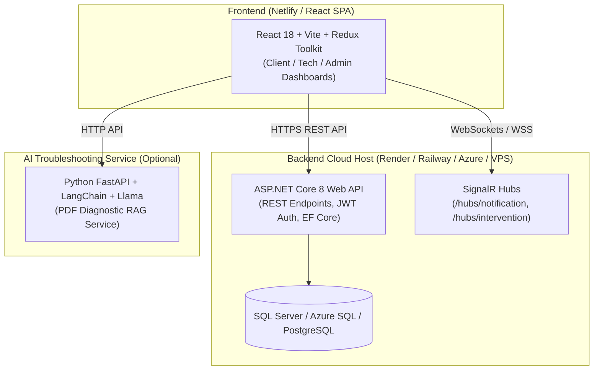

# 🛠️ AGIR - Repair Shop Management System

A comprehensive web platform designed for computer and mobile phone repair shops to streamline the end-to-end repair lifecycle, manage technicians and clients, track inventory and spare parts, automate billing and invoices, deliver real-time notifications, and provide AI-powered diagnostic troubleshooting.

---

## 📑 Table of Contents
- [Architecture Overview](#-architecture-overview)
- [Key Features](#-key-features)
- [Tech Stack](#-tech-stack)
- [Project Structure](#-project-structure)
- [Environment Variables & Configuration](#-environment-variables--configuration)
  - [Frontend (.env)](#1-frontend-environment-clientappenv)
  - [Backend (appsettings.json)](#2-backend-configuration-serverapisappsettingsjson)
  - [Default Seed Accounts](#3-default-seed-accounts)
- [Local Development Setup](#-local-development-setup)
  - [1. Backend Setup (.NET Core)](#1-backend-aspnet-core)
  - [2. Frontend Setup (React + Vite)](#2-frontend-react--vite)
  - [3. AI Chatbot Setup (Python/RAG)](#3-ai-chatbot-service-python-optional)
- [Deployment Guide](#-deployment-guide)
  - [Frontend on Netlify](#hosting-frontend-on-netlify)
  - [Backend Deployment](#hosting-backend-aspnet-core)
  - [Database Deployment](#database-sql-server--postgres)
- [License](#-license)

---

## 🏗️ Architecture Overview



---

## ✨ Key Features

- 👤 **Role-Based Access Control (RBAC)**:
  - **Admin**: Complete system control, user management, intervention assignment, analytics, stock alert configuration.
  - **Technician**: View assigned repair tickets, update diagnosis and repair progress, request replacement parts, log labor hours.
  - **Client**: Submit repair requests, track live repair status with visual step progress, view and download invoices, consult AI assistant.
- 🔧 **Intervention Lifecycle Tracking**: Track repairs from initial intake, inspection, and parts assembly to quality testing and customer pickup.
- 📦 **Inventory & Stock Management**: Real-time spare parts catalog with automated low-stock warnings and thresholds.
- 🔔 **Multi-Channel Real-Time Notifications**:
  - Live in-app notifications via **SignalR** WebSockets.
  - Automated SMS alerts via **Twilio**.
  - Automated Email updates via **SMTP**.
- 🧾 **Invoicing & Exporting**: Generate invoices with automated labor and parts calculation; export reports to **PDF**, **Excel (.xlsx)**, and **CSV**.
- 🤖 **AI Repair Assistant**: Retrieval-Augmented Generation (RAG) chatbot trained on technical repair manuals for self-service troubleshooting.

---

## 💻 Tech Stack

| Layer | Technologies |
| :--- | :--- |
| **Frontend** | React 18, Vite, Redux Toolkit, React Router v7, Material-UI (MUI), SignalR Client, Chart.js, Lucide Icons |
| **Backend** | ASP.NET Core 8, Entity Framework Core, SignalR, JWT Bearer Authentication, EPPlus, QuestPDF |
| **Database** | Microsoft SQL Server / Azure SQL (supports PostgreSQL with Npgsql) |
| **AI / RAG** | Python 3.10+, FastAPI, LangChain, ChromaDB, Ollama / Llama 3.2 |
| **Hosting** | Netlify (Frontend), Render / Railway / Azure (Backend & Database) |

---

## 📁 Project Structure

```
agir/
├── netlify.toml               # Netlify build and SPA routing configuration
├── client/
│   └── app/                   # React 18 + Vite frontend
│       ├── public/
│       │   └── _redirects     # SPA fallback redirect for Netlify
│       ├── src/
│       │   ├── components/    # Reusable UI tables, dialogs, navbars
│       │   ├── config/        # Centralized API endpoints (apiConfig.js)
│       │   ├── screens/       # Client, Technician & Admin views
│       │   ├── services/      # SignalR, Chatbot, and Parts API services
│       │   ├── store/         # Redux Toolkit slices (auth, users, etc.)
│       │   └── utils/         # Translations and formatting helpers
│       ├── .env.example       # Frontend environment template
│       ├── package.json
│       └── vite.config.ts     # Vite configuration
├── server/                    # ASP.NET Core 8 Backend
│   ├── Apis/                  # Controllers, Hubs mapping, and Program.cs
│   │   ├── appsettings.json
│   │   ├── appsettings.example.json
│   │   └── Program.cs
│   ├── Application/           # DTOs, Services, and Business Interfaces
│   ├── Core/                  # Domain Entities and Enums
│   ├── Hubs/                  # SignalR Intervention and Notification Hubs
│   └── Infrastructure/        # EF Core DbContext, Repositories, Migrations
└── llama/                     # Python RAG Chatbot Service
    ├── rag_server.py          # FastAPI / Flask Chatbot Server
    ├── requirements.txt
    └── env                    # Python environment settings
```

---

## 🔐 Environment Variables & Configuration

### 1. Frontend Environment (`client/app/.env`)
Create a `.env` file inside `client/app/`:

```env
# Backend ASP.NET Core API & SignalR URL (without trailing slash)
VITE_API_BASE_URL=https://localhost:7143

# Python AI Troubleshooting Chatbot URL
VITE_CHATBOT_URL=http://localhost:5000/api/chatbot
```

### 2. Backend Configuration (`server/Apis/appsettings.json`)
Configure your database connection and secrets in `server/Apis/appsettings.json`:

```json
{
  "Logging": {
    "LogLevel": {
      "Default": "Information",
      "Microsoft.AspNetCore": "Warning"
    }
  },
  "AllowedHosts": "*",
  "ConnectionStrings": {
    "DefaultConnection": "Server=localhost\\SQLEXPRESS;Database=AgirDb;Trusted_Connection=True;MultipleActiveResultSets=true;TrustServerCertificate=True"
  },
  "Jwt": {
    "Key": "YourSuperSecretJwtKeyForAgirRepairShop2025!MustBeAtLeast32CharsLong",
    "Issuer": "AgirApi",
    "Audience": "AgirClient"
  },
  "SmtpSettings": {
    "Host": "smtp.gmail.com",
    "Port": "587",
    "Username": "your-email@gmail.com",
    "Password": "your-app-password",
    "FromEmail": "noreply@repairshop.com"
  },
  "TwilioSettings": {
    "AccountSid": "ACxxxxxxxxxxxxxxxxxxxxxxxxxxxxxxxx",
    "AuthToken": "your_twilio_auth_token",
    "FromPhoneNumber": "+1234567890"
  }
}
```

### 3. Default Seed Accounts
On the initial run, the database seeds the following default accounts automatically:

| Role | Username | Email | Default Password |
| :--- | :--- | :--- | :--- |
| **Admin** | `admin` | `admin@repair.com` | `Admin123!` |
| **Technician** | `tech1` | `tech1@repair.com` | `Tech123!` |
| **Client** | `client1` | `client1@example.com` | `Client123!` |

---

## 🚀 Local Development Setup

### Prerequisites
- [Node.js](https://nodejs.org/) (v18 or higher)
- [.NET 8 SDK](https://dotnet.microsoft.com/download/dotnet/8.0)
- [SQL Server](https://www.microsoft.com/en-us/sql-server/sql-server-downloads) (or LocalDB / Docker SQL Server)
- [Python 3.10+](https://www.python.org/) (Optional, for AI Chatbot)

---

### 1. Backend (ASP.NET Core)

1. Open a terminal and navigate to the backend API directory:
   ```bash
   cd server/Apis
   ```
2. Restore dependencies:
   ```bash
   dotnet restore
   ```
3. Update database connection string in `appsettings.json` if needed.
4. Run the API (Migrations and seed data will execute automatically on startup):
   ```bash
   dotnet run
   ```
   * The API and Swagger documentation will be available at: `https://localhost:7143/swagger`

---

### 2. Frontend (React + Vite)

1. Open a terminal and navigate to the client app directory:
   ```bash
   cd client/app
   ```
2. Install npm dependencies:
   ```bash
   npm install
   ```
3. Ensure `.env` is configured with `VITE_API_BASE_URL=https://localhost:7143`.
4. Start the development server:
   ```bash
   npm run dev
   ```
   * The frontend application will be running at: `http://localhost:5173`

---

### 3. AI Chatbot Service (Python, Optional)

1. Navigate to the `llama` directory:
   ```bash
   cd llama
   ```
2. Create and activate a virtual environment:
   ```bash
   python -m venv venv
   # On Windows:
   .\venv\Scripts\activate
   # On macOS/Linux:
   source venv/bin/activate
   ```
3. Install Python dependencies:
   ```bash
   pip install -r requirements.txt
   ```
4. Start the chatbot server:
   ```bash
   python rag_server.py
   ```
   * Running on: `http://localhost:5000`

---

## 🌐 Deployment Guide

### Hosting Frontend on Netlify

1. Push your repository to **GitHub** or **GitLab**.
2. Log into [Netlify](https://app.netlify.com/) and click **"Add new site" &rarr; "Import an existing project"**.
3. Connect your repository.
4. Netlify will auto-detect the configuration from `netlify.toml`:
   - **Base directory**: `client/app`
   - **Build command**: `npm run build`
   - **Publish directory**: `dist`
5. Go to **Site Configuration &rarr; Environment Variables** and add:
   - `VITE_API_BASE_URL`: `https://your-backend-domain.com` (Your deployed ASP.NET Core URL)
   - `VITE_CHATBOT_URL`: `https://your-chatbot-domain.com/api/chatbot` (Optional)
6. Click **Deploy**.

---

### Hosting Backend (ASP.NET Core)

You can deploy the ASP.NET Core backend to **Render**, **Railway**, **Fly.io**, **Azure App Service**, or a **VPS**:

#### Example: Docker Deployment / Linux Host
```dockerfile
FROM mcr.microsoft.com/dotnet/sdk:8.0 AS build
WORKDIR /src
COPY . .
RUN dotnet restore "server/Apis/Apis.csproj"
RUN dotnet publish "server/Apis/Apis.csproj" -c Release -o /app/publish

FROM mcr.microsoft.com/dotnet/aspnet:8.0 AS runtime
WORKDIR /app
COPY --from=build /app/publish .
ENTRYPOINT ["dotnet", "Apis.dll"]
```

Set your production environment variables on the backend host:
- `ConnectionStrings__DefaultConnection`: Your cloud database connection string.
- `Jwt__Key`: A secure 32+ character key.
- `Jwt__Issuer`: `AgirApi`
- `Jwt__Audience`: `AgirClient`

---

## 📄 License
This project is proprietary and built for repair shop lifecycle management. All rights reserved.
